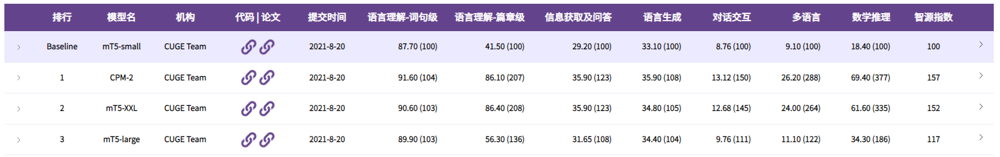

<!-- # CUGE (Chinese Language Understanding and Generation Evaluation Benchmark)
智源指数包含高质量中文自然语言处理数据集、排行榜与在线评测平台,旨在构建全面系统的中文机器语言能力评测体系,形成多层次维度的评测方案,力求更加科学、规范、高质量地推进中文自然语言处理技术的标准评测。智源指数体系和评测平台仍在不断建设和完善中，如果您对我们有任何建议或意见，欢迎在此项目处发起Issue进行讨论。

CUGE contains high-quality Chinese natural language processing datasets, leaderboard and online evaluation platform. CUGE aims to build a comprehensive and systematic Chinese language intelligence evaluation system, form a multi-level evaluation strategy, and promote the standard evaluation of Chinese natural language processing technology in a more scientific, standardized and high-quality manner. CUGE is still under construction and improvement. It's welcomed to create issues at this project for discussion if you have any suggestions or comments for us.
 -->
 
# CUGE (Chinese Language Understanding and Generation Evaluation Benchmark)

## 介绍(Introduction)
智源指数包含高质量中文自然语言处理数据集、排行榜与在线评测平台,旨在构建全面系统的中文机器语言能力评测体系,形成多层次维度的评测方案,力求更加科学、规范、高质量地推进中文自然语言处理技术的标准评测。

CUGE contains high-quality Chinese natural language processing datasets, leaderboard and online evaluation platform. CUGE aims to build a comprehensive and systematic Chinese language intelligence evaluation system, form a multi-level evaluation strategy, and promote the standard evaluation of Chinese natural language processing technology in a more scientific, standardized and high-quality manner. 

## 基准说明(Baselines in Leaderboard)

在GLUE的总排行榜<a href="http://cuge.baai.ac.cn/#/leaderboard">LeaderBoard</a>中，我们提供了几个基准模型的测试结果。这些基准模型分别是：

*	**CPM-2** : 一种大规模的中文预训练语言模型，是清华大学自然语言处理实验室(THUNLP)和北京智源研究院联合2021年5月发布的，兼顾语言理解和语言生成的功能。这里使用了CPM-2的非MoE版本的纯中文模型，模型参数量为110亿。该模型下载及使用请参考<a href="https://github.com/TsinghuaAI/CPM-2-Finetune"> CPM-2</a>

*	**mT5** : 一种大规模生成式的多语言预训练语言模型，是由Google Research在2020年10月发布的。该多语言模型涵盖了110中语言。我们使用了其mT5-small、mT5-large、mT5-XXL版本作为基准模型进行了测试，这三个模型的参数量分别为3亿、12亿和130亿。该模型下载及使用请参考<a href="https://github.com/google-research/multilingual-t5"> mT5</a>: 

In the CUGE leaderboard, we provide the test results of several baselines. These baselines are:

*	<a href="https://github.com/TsinghuaAI/CPM-2-Finetune"> CPM-2</a> :  A large-scale Chinese pre-training language model was jointly released by the Natural Language Processing Laboratory of Tsinghua University (THUNLP) and the Beijing Academy of Artificial Intelligence (BAAI) in May 2021. This model has the ability of the language understanding and language generation. The non-MoE, pure Chinese version of CPM-2 is used here, and it has 11 billion parameters. 

*	<a href="https://github.com/google-research/multilingual-t5"> mT5 </a> : is a large-scale generative multilingual pre-training language model, released by Google Research in October 2020. The multi-language model covers 110 languages. We used its **mT5-small**, **mT5-large**, and **mT5-XXL** versions as benchmark models for testing. 
The parameters of these three models are 300 million, 1.2 billion, and 13 billion, respectively. 

## 问题反馈（Issues）
智源指数体系和评测平台仍在不断建设和完善中，如果您对我们有任何建议或意见，欢迎在此项目处发起Issue进行讨论。

CUGE is still under construction and improvement. It's welcomed to create issues at this project for discussion if you have any suggestions or comments for us.
